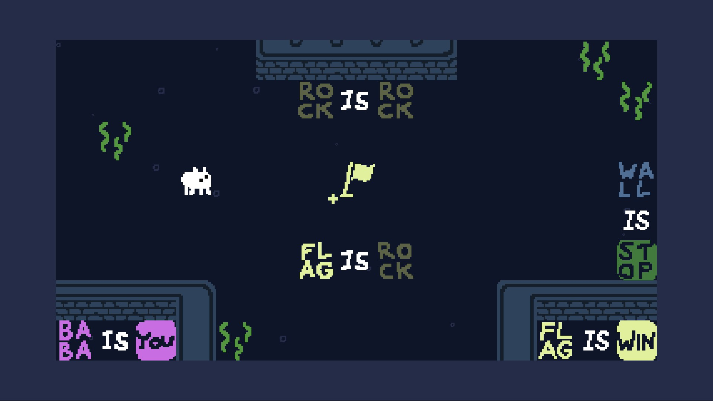
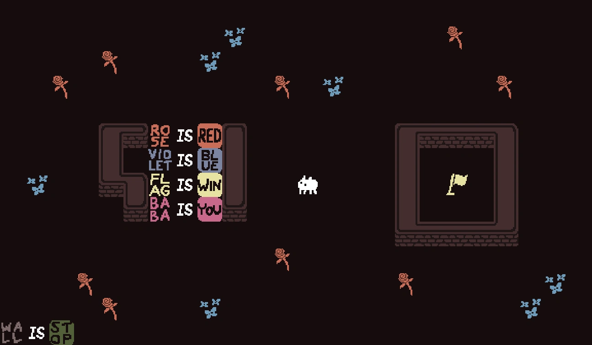

  [*Baba is You*](https://hempuli.com/baba/) was my game of the year. It's a mind-blowing puzzle game and it has cute graphics. But beyond that, it's also the perfect game for a linguistic analysis! 

This might not often be relevant when talking about games; but I studied linguistics in college and that was a while ago... Also, linguistic theories can get quite complicated, even when you didn't forget about half of them. So I'll try to keep it as simple as possible.

*Baba is You* is essentially a sokoban game, but instead of crates, you get to move blocks of texts that constitute the rules for the current level, or what those text blocks **represent** in the game world, i.e. you can push a block of text that says "rock" as well as an image of a rock on the screen. 

In terms of semiotics, the study of signs, these two notions together can be called the sign **rock**. Using Ferdinand de [Saussure's terminology](https://www.amazon.com/Course-General-Linguistics-Court-Classics/dp/0812690230) the word "rock" would be the *signifier*, which means it's merely a form that a sign takes, such as a word or icon, whereas the image of a rock in the game would be *signified*, which is what the signifier represents in our minds (or the game screen?). Semioticians like to deconstruct signs, because meaning is unstable and what a signifier signifies can change over time and according to context. Just like  in *Baba is You*: Solving the puzzles in the game actually requires manipulating its rules, therefore changing the positions of the text blocks on the screen, which results in changes in their signified representations. For example, the three block rule `flag-is-win` standing together means reaching the signified flag is the win condition in a level. In a situation where your player-character has no access to the signified flag, but the signifier "flag", and another sign combination, such as a rock and the text "rock", changing the signified rock to a signified flag by forming the rule: "rock is flag" can be the solution to the level, as will turn the signified rock into a signified flag that is accessible. 

However, signifier and signified, as a binary system, might be misleading, and although my **rock** example makes it look like the objectual representation= signified, meanings are more complicated than that. Think of  René Magritte’s [famous painting](https://collections.lacma.org/node/239578); the word “pipe” is a text referring to a pipe, but the image of a pipe is not the referent, instead simply an image of a pipe. Charles Sanders Peirce makes [another categorization](https://muse.jhu.edu/book/41103) of sign systems, and he splits a sign into  three components: *representamen*, *object* and *interpretant*. And I feel like this might be a better fit for the case of *Baba is You* , especially in situations where you are present with rules such as the titular one "Baba is you". Baba, the main character in the game, is pictured as -what I would like to think as- a white bunny on the screen. The rule `Baba is you` means that the player is in control of Baba. So the text "Baba", signifies two things simultaneously: the fact that Baba is that white object and that *you* control it. This is where Peirce's categorization differs from Saussure's. Peirce's term *object* simply refers to the subject matter of a sign, so in the example of `Baba is you`, it would be the objectual image of Baba on the screen, while what he calls *interpretant* refers to the meaning of the sign, which would be Baba in the sense of the player-character (or *you*) on the screen. The text "Baba", on the other hand, would be "representamen", which is just the Peircian name for Saussure's "signifier" as far as I understand. 

While *Baba is You* asks you to decide and mess with what a signifier means and represents, there are of course some limitations that make it impossible for you to just put together a sentence like “Baba is win” and complete every level with ease. For example, you are free to break the sentence `Baba is you` apart by moving its components around, but doing so will result in you *not being* your player-character Baba anymore, and you can't control anything on the screen anymore, unless you have put together another rule, such as `rock is you` to claim yourself as an object. This means there has to be a signifier or representamen which represents the idea of *you* at all times. But *you* can also be a part of another sign at the same time, thus giving *you* multiple properties. The game often provides a limited number of accessible text-blocks and force the players into forming a horizontal and a vertical sentence that share a single block of text, such as: 

This mechanic makes the game more complex, because it makes the players think of the blocks as more than just pairs of pictures and texts.  According to semiotics, this is also how linguistic signs work, they only make sense in relation to each other (a huge part of  Saussure’s theory and chess analogy). If that doesn't sound complicated enough, also keep in mind that signs can be a signifier of another sign system as well, and this way we keep building meanings on other meanings. *Baba is You* also wants you to use meta-signs and think of each sign in relation to others, but it also takes advantage of associations that make outside of the screen. While playing the initial levels, I spent several minutes trying to figure out how I can go behind a wall, until I noticed that I could simply walk through it. As the rules for every level are written on the screen, if an object has no information in the form of a sensical and coherent text, it has no properties. So unless you see a text that says "wall” is something, it won't have any mechanical attribute, as if it's not there. But even after I figured this out, I sometimes found myself thinking a wall or lava was blocking my way when there was no such rule. The game of course has many levels where you see `box is push`, `wall is block` and `key is open`, which makes it even more of a challenge to notice that they're not doing what they are expected to do, when the rules are different. 

In semiotics the relationship between a signifier and signified can be on two levels; which are denotation, the literal meaning, and connotation (theorized mainly by [Barthes](https://www.amazon.com/Mythologies-Roland-Barthes/dp/0374521506)). And although *Baba is You* is not a story-heavy game, a different setting and visuals, or lack of them, (if you pushed around geometric shapes, for example) could eliminate the challenge of misleading connotations. The words "wall" or "box" in the game have much stronger connotations than "Baba" (if  later has any), and if all signs in the game would be names such as Baba and Keke (which are both based on [a linguistic experiment](https://www.reddit.com/r/NintendoSwitch/comments/ben6qj/hi_im_hempuli_the_developer_of_baba_is_you_ask_me/el71s4i/) themselves) or simply gibberish, it would be interesting because the experience of playing such a game would be similar to learning a new language by trying to decipher the signs, but it would also be less fun in my opinion, because it wouldn't challenge the connections my mind tries to make. 

I don’t think that *Baba is You* is intended to be a game about linguistics, and it doesn’t need to be, but just I like how semiotic theories are applicable to this game when it comes to deconstructing stuff and sense-making. If you still haven’t played it, it’s available on  [Steam](https://store.steampowered.com/app/736260/Baba_Is_You/) and [Nintendo Switch](https://www.nintendo.com/games/detail/baba-is-you-switch/).
